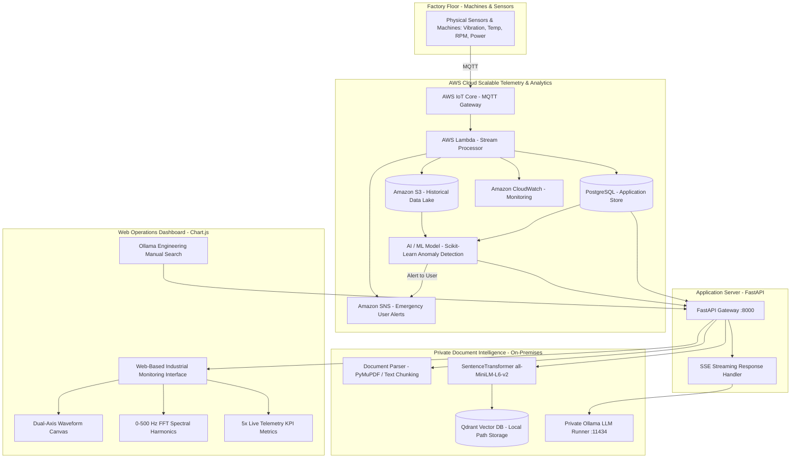

# SmartHub AI - Comprehensive Project Report
**Unified Smart Factory Logistics & Industrial Engineering AI Platform**

---

## Executive Summary

**SmartHub AI** (EngineeringAI Hub & FactoryFlow Logistics) is a hybrid industrial IoT and AI platform designed for smart manufacturing, substation operations, and heavy electrical engineering environments. 

The platform strategically combines **AWS Cloud scalable telemetry infrastructure** with **private on-premises document intelligence**:
1. **Cloud-Scale IoT Telemetry & Analytics (AWS)**: Factory floor machines and sensors transmit high-frequency sensor readings (Vibration, Temperature, RPM, Power Load, and 0–500 Hz FFT Harmonics) over **MQTT** to **AWS IoT Core**. Serverless **AWS Lambda** handlers process the stream, committing application state to **PostgreSQL** and streaming long-term historical records into **Amazon S3**. **Amazon CloudWatch** tracks metric alarms, while **Amazon SNS** dispatches emergency push alerts to engineers. Predictive **Scikit-learn** anomaly models continuously score equipment degradation.
2. **Private Document Search Engine (Ollama RAG + Qdrant)**: For confidential technical documentation, OEM manuals, and commercial tender bids, the system uses a private **Ollama** engine (`qwen2.5:3b`) and a local **Qdrant Vector DB**. This guarantees that sensitive corporate blueprints and proprietary parameters never leave the factory's private boundary, eliminating third-party public cloud AI privacy risks and recurring token fees.

---

## 1. System Architecture



---

## 2. Core Technology Stack

| Layer / Domain | Technologies Used | Specifications & Architecture Role |
| :--- | :--- | :--- |
| **Edge Protocol** | MQTT, Python, Linux / Ubuntu | High-frequency telemetry publisher connecting factory sensors to cloud gateway. |
| **AWS Ingestion & Compute** | AWS IoT Core, AWS Lambda | Cloud-scale IoT message broker and serverless stream transformation. |
| **Cloud Storage** | Amazon S3, PostgreSQL | Append-only raw historical data lake (S3) and transactional relational storage (Postgres). |
| **Cloud Monitoring & Alerts**| Amazon CloudWatch, Amazon SNS | Continuous metric tracking, log aggregation, and automated SMS/Email alert dispatching. |
| **Machine Learning** | Scikit-learn, Pandas, NumPy | Anomaly classification, trend regression, and ISO 10816 vibration severity scoring. |
| **Backend API Gateway** | FastAPI, Uvicorn (Python 3.12) | High-performance asynchronous REST endpoints, Server-Sent Events (SSE) streaming. |
| **Document Search AI** | Ollama (`qwen2.5:3b`), Qdrant 1.19.0 | Private on-premises semantic search across confidential OEM manuals (zero cloud leakage). |
| **Embeddings Model** | `sentence-transformers` (`all-MiniLM-L6-v2`) | Local 384-dimensional dense vector embeddings generated in-memory. |
| **Frontend UI & DevOps** | HTML5, CSS3, ES6+ JavaScript, Chart.js 4.x | Real-time dual-axis waveforms, 0–500 Hz FFT harmonics, and pure CSS utility engine. |
| **DevOps & Packaging** | Docker, Git / GitHub | Containerized multi-service deployment for cloud and edge hosts. |


---

## 3. Functional Modules & Capabilities

### 3.1 Live Factory Monitoring & Real-Time IoT Telemetry
- **Continuous Dual-Axis Waveform Stream**:
  - Left Y-Axis: **Vibration Velocity** (`IPS` - Inches Per Second) in royal electric blue.
  - Right Y-Axis: **Winding / Oil Temperature** (`°C`) in coral red.
  - Vertical glowing gradients under curves for rapid visual scannability.
  - Toggleable ISO warning (`0.28 IPS / 85°C`) and critical (`0.45 IPS / 105°C`) threshold lines.
  - Sliding time window selector: **30s**, **60s** (default), and **3m**.
  - Interactive **Pause / Resume Feed** stream toggle.
- **Vibration FFT Spectral Harmonics (0 – 500 Hz)**:
  - Real-time frequency-domain breakdown identifying:
    - **1X Shaft Baseline** (Rotational speed unbalance).
    - **2X Harmonic** (Shaft/coupling misalignment).
    - **4X & Line Frequency Hum** (Electromagnetic ripple).
    - **High-Frequency Band (250–450 Hz)** (Bearing cage, race, and ball wear).
- **5 Real-Time KPI Metric Cards**:
  1. *Vibration Velocity*: Real-time IPS, peak-hold value, and dynamic ISO 10816 Class I condition badge.
  2. *Winding / Oil Temperature*: Core temperature, dynamic headroom calculation relative to nominal trip limit (115°C).
  3. *Shaft Speed & Frequency*: Live motor RPM / 50.02 Hz grid sync, Total Harmonic Distortion (THD).
  4. *Active Power Load*: Power draw in kW, load current in Amperes, operating efficiency (98.6%).
  5. *MQTT Edge Pipeline*: Ingestion packet rate (10 pkts/s), edge latency (12–15 ms), 0.0% packet drop.
- **Multi-Machine Dynamic Profiles**:
  - Live switcher supporting:
    - **Transformer X** (25MVA Substation Primary).
    - **MCC Panel A** (Motor Control Center).
    - **CNC Milling Spindle #3** (High-speed 12,000 RPM spindle).
    - **Hydraulic Press Unit #2** (High-pressure stamping press).
- **Real-Time Telemetry Alarm & Event Stream**:
  - Scrolling event table recording timestamped sensor readings, anomaly tags, alert severities, and recommended operator diagnoses.

---

### 3.2 Engineering Knowledge Assistant (Manuals & Schematics RAG)
- **Document-Grounded Conversational RAG**:
  - Answers engineering inquiries using only verified technical manuals, OEM specifications, and drawings indexed in Qdrant.
  - Formats responses using Markdown headers, checklists, tables, and electrical equations.
  - Explicitly states when queries fall outside the indexed documentation to prevent hallucinations.
- **Interactive Document Citations**:
  - Every response extracts vector similarity matches and renders clickable citation chips (e.g. `Transformer_X_Manual.txt (Pg 1)`).
  - Modal inspection displays the exact excerpt chunk and similarity relevance score.
- **Session Management**:
  - Multi-session discussion organizer stored in SQLite with full historical reload and session deletion.

---

### 3.3 Predictive Maintenance Diagnostics
- **Sensor Anomaly Synthesis**:
  - Correlates incoming live telemetry symptoms with historical failure modes logged in the SQL database.
  - Synthesizes findings with OEM manual troubleshooting sections via local LLMs.
- **Structured Diagnostic Report**:
  - **Possible Causes**: Ranked list of mechanical/electrical root causes (e.g., fan motor seizure, oil contamination, dielectric degradation).
  - **Recommended Inspections**: Step-by-step checklist for on-site technicians (torque checks, insulation resistance Megger testing, SF6 pressure checks).
  - **Confidence Level**: Computed confidence score (Low / Medium / High) accompanied by justification.
  - **Real-Time Fault Signature Visualizer**: Updates an inline SVG waveform representing the fault signature against nominal warning thresholds.
- **Historical Failures Log**:
  - Sub-tab allowing technicians to review and lock new field failure reports into the SQLite database.

---

### 3.4 Customer Support Bot Sandbox
- Dedicated portal simulator restricted strictly to public FAQs and catalog specifications.
- Protects confidential internal engineering blueprints from client-facing exposure.
- Delivers polite, step-by-step warranty and installation guidance.

---

### 3.5 Proposal & Tender Draft Generator
- **Industrial Bid Creator**:
  - Generates formal technical and commercial proposals for tenders (e.g., 33kV substation extensions, 11kV distribution switchrooms).
  - Automatically incorporates past contract extracts from the proposal database and vectorized tender specifications.
  - Produces structured 4-section drafts:
    1. *Executive Summary*
    2. *Technical Specifications & Compliance*
    3. *Project Schedule & Execution*
    4. *Commercial Framework*
- **Tender Archive & Approval**:
  - In-browser editor for lead design engineers to review, adjust, and sign off proposals into the system.

---

### 3.6 Enterprise Cross-Channel Search
- Single unified search box executing simultaneous federated queries across:
  1. *Qdrant Vector Database*: Semantic similarity matches across manuals and FAQs.
  2. *SharePoint / Document Index*: Document title and file metadata matching.
  3. *Sales / ERP Database*: Customer names, project titles, and proposal statuses.
  4. *DevOps / CMMS Database*: Historical maintenance tickets, symptoms, and resolutions.
- Results ranked by relevance score and categorised by data origin.

---

### 3.7 Vector Document Database Management
- Drag-and-drop file uploader supporting `.pdf` and `.txt`.
- Categorized channels (`engineering`, `customer_support`, `proposals`).
- Automated text extraction, chunking (PyMuPDF), vector embedding generation, and atomic Qdrant indexing.
- Cascading deletion (removes vectors from Qdrant, deletes file from disk, purges metadata from SQLite).

---

## 4. Technical Audit & Debugging History

During comprehensive end-to-end testing, three critical system bugs and design issues were identified and resolved:

### Bug 1: Deprecated Qdrant Client Search Method
* **Symptom**: Engineering Chat streaming abruptly closed connections (`curl: (18) transfer closed with outstanding read data remaining`); frontend showed `[Error calling Ollama API stream. Ensure backend is running.]`; Maintenance Diagnostics and Proposal Generator failed with HTTP 500.
* **Root Cause**: `qdrant-client` version 1.19.0 removed the legacy `.search()` method in favor of `.query_points()`. Invoking `qdrant_client.search()` raised an unhandled `AttributeError: 'QdrantClient' object has no attribute 'search'`.
* **Resolution**: Refactored `search_vectors()` in `backend/vector_store.py`:
  ```python
  # Before (Broken):
  search_results = qdrant_client.search(
      collection_name=COLLECTION_NAME,
      query_vector=query_vector,
      query_filter=query_filter,
      limit=limit
  )
  for hit in search_results: ...

  # After (Fixed):
  search_results = qdrant_client.query_points(
      collection_name=COLLECTION_NAME,
      query=query_vector,
      query_filter=query_filter,
      limit=limit
  )
  for hit in search_results.points: ...
  ```

### Bug 2: Missing JavaScript Variable Declaration
* **Symptom**: Clicking "Draft Tender Proposal" occasionally threw an unhandled browser error: `ReferenceError: generating is not defined`.
* **Root Cause**: In `frontend/app.js`, `handleProposalGenerate` checked `if (generating) return;` without an initial `let generating = false;` declaration.
* **Resolution**: Added `let generating = false;` to global state variables in `app.js`.

### Bug 3: Live Factory Canvas Stretched & Unstyled
* **Symptom**: The factory telemetry chart was an unconstrained canvas with inline dark backgrounds that stretched down the page; KPI cards stacked vertically as unstyled text lines.
* **Root Cause**: FastAPI served the frontend as static files via `app.mount("/", StaticFiles(directory=frontend_dir, html=True))`. The HTML relied on Tailwind utility classes (`flex`, `items-center`, `gap-4`, `p-4`) that were never compiled into `style.css`. Furthermore, Chart.js (`maintainAspectRatio: false`) was placed in a parent `div` without a fixed height.
* **Resolution**:
  - Implemented complete Vanilla CSS utility definitions (`.flex`, `.flex-col`, `.items-center`, `.justify-between`, `.gap-*`, `.p-*`, `.space-y-*`) in `style.css`.
  - Encapsulated charts in dedicated responsive wrappers (`.telemetry-chart-wrapper`, `.fft-chart-wrapper`) with fixed heights (320px).
  - Built dual-axis gradient styling, threshold lines, 5 KPI cards, FFT harmonic spectrum, and live event log table.

---

## 5. Verification & Test Matrix

| Test Case | Method | Input / Scenario | Expected Outcome | Result |
| :--- | :--- | :--- | :--- | :---: |
| **System Health** | REST API | `GET /api/health` | HTTP 200, DB: HEALTHY, Status: UP | ✅ PASSED |
| **Ollama Connectivity** | REST API | `GET /api/status` | Ollama connected: true, models listed | ✅ PASSED |
| **Vector Search Retrieval** | REST API | `GET /api/search?query=transformer` | Returns document chunks with similarity scores & pages | ✅ PASSED |
| **Engineering Chat Stream** | SSE Stream | `POST /api/chat/message` ("Insulation class?") | Streams tokens citing `Transformer_X_Manual.txt (Pg 1)` | ✅ PASSED |
| **Maintenance Diagnosis** | REST API | `POST /api/maintenance/analyze` | Returns possible causes, inspections & confidence | ✅ PASSED |
| **Proposal Generator** | REST API | `POST /api/proposals/generate` | Generates 4-part tender draft and citations | ✅ PASSED |
| **Live Telemetry Stream** | Browser UI | Navigation to Live Factory | Dual-axis live graph updates every 2s with gradients | ✅ PASSED |
| **FFT Spectral Harmonics** | Browser UI | Inspection of 0–500 Hz Chart | Renders 7 harmonic bars with clear color categories | ✅ PASSED |
| **Asset Dynamic Switcher** | Browser UI | Dropdown select `MCC Panel A` | Telemetry baselines, thresholds, and FFT update dynamically | ✅ PASSED |
| **Stream Controls** | Browser UI | Click "Pause Feed" / "Resume" | Feed pauses/resumes, UI badge updates cleanly | ✅ PASSED |
| **Time Window Filters** | Browser UI | Click `30s`, `60s`, `3m` | Sliding window points adjust seamlessly | ✅ PASSED |
| **Code Linting** | Oxlint | `npx oxlint app.js` | 0 errors | ✅ PASSED |

---

## 6. Directory Structure

```
SmartHub/
├── backend/
│   ├── config.py                 # Configuration for DB, MQTT, AWS, Qdrant, Ollama
│   ├── database.py               # SQLAlchemy database engine & SQLite fallback
│   ├── document_parser.py        # PyMuPDF PDF parser and text chunking
│   ├── main.py                   # FastAPI application routes, CORS, static mount
│   ├── models/                   # Unified SQLAlchemy ORM domain models
│   ├── qdrant_storage/           # Local persistent on-disk Qdrant vector storage
│   ├── rag_pipeline.py           # RAG retrieval, Ollama streaming, predictive maintenance
│   ├── services/                 # AWS IoT & Edge connector services
│   └── vector_store.py           # Qdrant client, query_points search, chunk indexing
├── frontend/
│   ├── app.js                    # Core application logic, Chart.js telemetry engine
│   ├── index.html                # Single page layout, Live Factory dashboard, sub-tabs
│   ├── style.css                 # Industrial design system, glassmorphism tokens, pure CSS
│   ├── package.json              # Frontend scripts & devDependencies
│   └── vite.config.js            # Optional Vite dev server configuration
├── smarthub.db                   # Local persistent SQLite database file
├── requirements.txt              # Python runtime dependencies
└── PROJECT_REPORT.md             # This comprehensive technical report
```

---

## 7. How to Run the Project

### Prerequisites
1. **Python 3.10+** (with virtual environment in `venv/`).
2. **Ollama** installed and running locally on port `11434` with at least one model:
   ```bash
   ollama run llama3.2:3b
   # or
   ollama run qwen2.5:3b
   ```

### Running Backend & Frontend
Since FastAPI serves the frontend directly from `frontend/index.html`, starting Uvicorn launches both the REST API and the web interface on a single port:

```powershell
# From the workspace root (d:\Hub-2\SmartHub)
.\venv\Scripts\activate
python -m uvicorn backend.main:app --reload --host 127.0.0.1 --port 8000
```

Open your browser and navigate to:
```
http://localhost:8000/
```
The Swagger interactive API documentation is available at:
```
http://localhost:8000/docs
```

---

